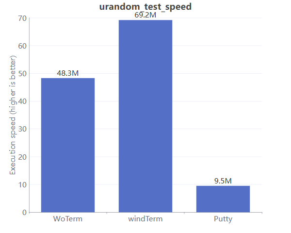

---

# Informe de Pruebas de Rendimiento de WoTerm

Esta prueba se realizó con **la versión v10**, ya que las versiones posteriores incluyen optimizaciones profundas del núcleo.  
Gracias a los usuarios por su aliento y apoyo, y también al autor de **WindTerm**: aunque nunca nos hemos conocido ni intercambiado experiencias técnicas, WindTerm es un excelente software y ha servido de inspiración para algunas funciones de WoTerm.

---

## 🖥 Entorno de pruebas

| Componente       | Configuración                          |
|------------------|----------------------------------------|
| **Host WoTerm**  | i5 de 12.ª gen, 48 GB RAM              |
| **Servidor test**| 2 núcleos, 8 GB RAM, Fedora, VM modo NAT |

---

## ⚙ Comandos de prueba

| Comando             | Descripción                     |
|---------------------|---------------------------------|
| `time seq 10000000` | Genera 10 millones de líneas    |
| `urandom_test.sh`   | Genera 100 MB de datos aleatorios |

---

## 📦 Versiones de los programas

| Programa    | Versión |
|-------------|---------|
| **WoTerm**   | v10.2.1 |
| **WindTerm** | v2.7.0  |
| **PuTTY**    | v0.83   |

---

## ⏱ Metodología

- **Fecha de prueba:** 18 de abril de 2025  
- Cada comando se ejecutó **al menos 10 veces**  
- Se eliminaron los **valores máx. y mín.** y se promedió  

---

## Tiempo de procesamiento del comando

Se ejecutó `time seq 10000000` en el servidor y se cronometró el tiempo total con el temporizador del móvil.  
El tiempo impreso por el comando solo refleja el instante en que el hilo SSH termina de recibir datos, por lo que no es justo.  
El flujo de datos es:

*hilo SSH → hilo principal → hilo terminal → hilo principal muestra*

Por eso se usó el cronómetro.  

### Tiempo de procesamiento del comando
  

## Comparación de throughput urandom_test

Se compara **registros por segundo (throughput)**.  

### Throughput de ejecución
  

## Uso de memoria tras urandom_test

Se muestra el **incremento de memoria** tras el comando (se resta la memoria base tras el arranque).  

### Uso de memoria
  

*Nota: los resultados se refieren a la configuración indicada; en otro hardware pueden variar.*